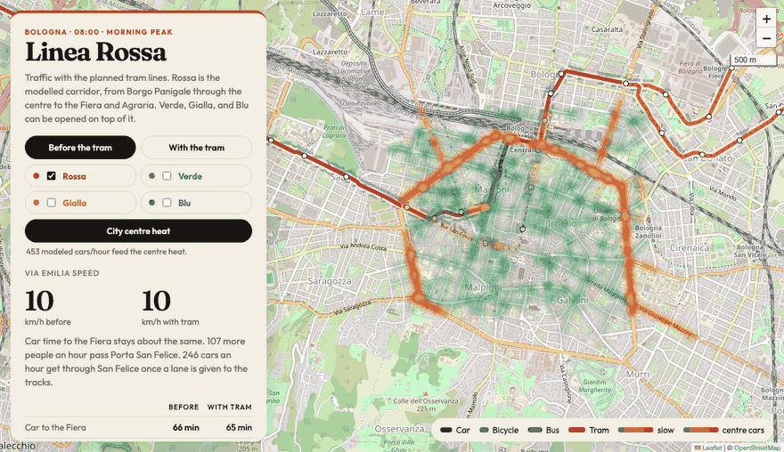

# Bologna tram traffic

A morning-peak model of Bologna’s **Linea Rossa**: Borgo Panigale through the historic centre, then out to the Fiera (Michelino) and to the Faculty of Agriculture at Pilastro.

The map shows the corridor **before** the tram (cars, buses, bicycles) and **with** the tram. Pick a time of day and a model, then move the sliders for how many drivers switch and how often the tram runs. **Predict best setup** searches that model’s saved grid for the shift and tram frequency that carry the most people through San Felice, keep the waiting queue short, and limit the extra car time to the Fiera. **Export report** downloads that result as an HTML file: the chosen setup, the before-and-after table, and the other setups that were compared.



## Disclaimer

This project is an illustration built from data that public agencies already publish on the web. The numbers on the map are the output of the models in this repository. They are not a forecast, a design study, or an official figure from the Comune di Bologna, TPER, the tram project, or any other authority.

A few inputs are assumptions, because the published data does not contain them:

- Traffic-signal **positions** come from OpenStreetMap. Signal **timings** do not. Every junction is treated as a 90 second cycle with 40 seconds of green for the corridor.
- Car demand is taken from boulevard loop detectors on Viale Ercolani and Viale Pietramellara, then applied to the corridor. Those loops are not on Via Emilia.
- The bus count is the number of trips that stop at Porta San Felice between 08:00 and 09:00. The “with tram” scenario takes those buses off the alignment.
- Car occupancy (1.3 people) and a full bus (45 people, 90 seats of capacity) are modelling choices.
- Where a cycle track already runs along most of a street in OpenStreetMap, bicycles are treated as protected. The scenario does not add new cycle tracks.

Published checks for the real line, used only as context: about 16.5 km, a tram every 4–5 minutes, about 40 minutes from Borgo Panigale to the Fiera and 52 minutes to Agraria. Passenger service is expected in 2027.

## Installation

You need [Node.js](https://nodejs.org/) 20 or newer and Python 3.12.

```bash
git clone https://github.com/gfiameni/bologna-tram-traffic.git
cd bologna-tram-traffic

npm install
python3.12 -m venv .venv
.venv/bin/pip install -r requirements.txt

npm test
npm run models
npm run dev
```

Open the URL Vite prints, usually http://localhost:5173.

`npm test` checks the browser volume-delay fallback. `npm run models` checks the Python models, including that the Warp kernels match their NumPy twins.

The page reads `public/catalog.json`, a grid of saved runs, so the map works with the dev server alone. For a slider position that is not on that grid, start the model server in a second terminal:

```bash
npm run serve-models
```

It listens on http://127.0.0.1:8765. The page calls it when you move a slider off the saved grid.

### Refresh the open data

`data/raw/` is downloaded on demand and is not part of the git repository. To pull a new extract and rebuild the saved runs:

```bash
.venv/bin/python scripts/fetch_supply.py
npm run catalog
```

`scripts/build_network.py` rebuilds `public/network.json` from named OpenStreetMap streets (`npm run network`).

## Run on DGX Spark

DGX Spark already has the NVIDIA driver and the CUDA 13 toolkit. The cell-transmission and car-following kernels run on the GB10 when Warp is the CUDA 13 build for Linux aarch64. The PyPI `warp-lang` wheel is built against CUDA 12.9, so install the CUDA 13 wheel below instead.

Install Node.js 20 or newer if `node --version` is older than that, then:

```bash
git clone https://github.com/gfiameni/bologna-tram-traffic.git
cd bologna-tram-traffic

npm install
python3 -m venv .venv
source .venv/bin/activate
pip install -r requirements.txt
pip install --force-reinstall \
  https://github.com/NVIDIA/warp/releases/download/v1.17.0/warp_lang-1.17.0+cu13-py3-none-manylinux_2_34_aarch64.whl

.venv/bin/python -c "import warp as wp; wp.init(); print([str(d) for d in wp.get_devices()])"
npm test
npm run models
```

The device list should include `cuda:0`. `nvidia-smi` should show the GB10.

Start the map and the model server in two terminals, with the virtualenv active in the second:

```bash
npm run dev
```

```bash
source .venv/bin/activate
npm run serve-models
```

Open http://localhost:5173 on the Spark. From another computer, forward both ports:

```bash
ssh -L 5173:localhost:5173 -L 8765:localhost:8765 <spark>
```

`npm run serve-models` evaluates slider values on CUDA. The saved grid in `public/catalog.json` was computed with the NumPy form of the same update. Rebuild it on the Spark so the file records the GPU:

```bash
npm run catalog
```

The tests check that the Warp step and the NumPy step agree.

## Technology

| Piece | Role |
| --- | --- |
| [Vite](https://vite.dev/) 6 | Dev server and production build for the map |
| [Leaflet](https://leafletjs.com/) | Map, OpenStreetMap tiles, route lines |
| Browser JavaScript | Animation, sliders, and a volume-delay fallback if `catalog.json` is missing |
| Python 3.12, [NumPy](https://numpy.org/) | Corridor models and the saved catalog |
| [NVIDIA Warp](https://nvidia.github.io/warp/) | Cell-transmission and car-following kernels. On DGX Spark, install the CUDA 13 aarch64 wheel so they run on the GB10 |
| Small NumPy network | 12-neuron surrogate trained on cell-transmission runs of this corridor |

The neural model is fit to this corridor’s cell-transmission runs. It is not a city-wide forecast model, and it does not use NVIDIA PhysicsNeMo.

## Models

- **Volume-delay.** A BPR curve plus Webster delay at each signal. Every car trip is assigned; a crowded street gets slower.
- **Cell transmission.** Daganzo’s cell model. Signals stop the cells on red. If demand is above what the greens can clear, fewer cars get through San Felice.
- **Car following.** The Intelligent Driver Model, with buses dwelling at stops and bicycles either on a cycle track or in the traffic.
- **Neural surrogate.** A 12-neuron network trained on cell-transmission runs of this corridor. The holdout error, in minutes per street, is shown in the assumptions on the map.

## What the scenario does

Eastbound traffic in the weekday morning peak.

- **Before:** cars and the buses that pass Porta San Felice share the street. Bicycles use the corridor, including the centre.
- **With the tram:** those buses leave the alignment, a chosen share of drivers switch, and streets where the tracks run give up a lane. Cars go around the historic centre on the avenues. The tram runs on a timetable (about 7.6 m/s, 26 seconds at each stop). Bicycles stay.

The extract shipped with the repository, built from the sources below, uses about 1,156 cars an hour, 46 buses an hour at Porta San Felice, and 57 bicycles an hour at the Stalingrado counter.

## Data sources

Everything below is data the publishers make available online. Each source keeps its own licence. The MIT licence on the code in this repository does not replace those licences.

| Source | What this project uses | Retrieved | Licence |
| --- | --- | --- | --- |
| [OpenStreetMap](https://www.openstreetmap.org/copyright) | Named streets for the corridor, traffic-signal positions, cycleways, bus-stop positions. Stored in `public/network.json` and in the signal and stop lists inside `data/supply.json`. | Overpass, September 2026 | [ODbL 1.0](https://opendatacommons.org/licenses/odbl/1-0/) |
| [Comune di Bologna, Traffico viali](https://opendata.comune.bologna.it/explore/dataset/traffico-viali/) | Weekday 08:00–09:00 loop counts. The corridor demand is the median of the peak direction on Viale Ercolani (south, about 1,160 veh/h) and Viale Pietramellara (north-east, about 1,152 veh/h). | Open Data API, September 2026 | [CC BY 4.0](https://creativecommons.org/licenses/by/4.0/). Publisher: Comune di Bologna |
| [Comune di Bologna, Rilevazione flussi bici](https://opendata.comune.bologna.it/explore/dataset/colonnine-conta-bici/) | Hourly bicycle counters. The run uses Stalingrado II, the counter nearest the corridor, on 23 September 2026, 08:00–09:00 local, peak direction 57 bikes/h. | Open Data API, September 2026 | [CC BY 4.0](https://creativecommons.org/licenses/by/4.0/). Publisher: Comune di Bologna |
| [TPER GTFS, Bologna](https://solweb.tper.it/web/tools/open-data/open-data-download.aspx?source=solweb.tper.it&filename=gommagtfsbo&version=20260909&format=zip) | Weekday service on 23 September 2026, 08:00–09:00, at the Porta San Felice stop with the most trips (46 buses/h). Feed version `20260909`. | TPER open data, September 2026 | [CC BY 3.0 IT](https://creativecommons.org/licenses/by/3.0/it/) |

`public/catalog.json` and `data/surrogate.json` are computed from those inputs by the models in `sim/`.

Attribution for the street geometry: © OpenStreetMap contributors.

## Licence

Original source code in this repository is released under the [MIT Licence](LICENSE). Copyright © 2026 gfiameni.

Map geometry derived from OpenStreetMap, including `public/network.json`, stays under the Open Database Licence. Counts and timetables derived from the Comune di Bologna and from TPER stay under the licences in the table above. Those files are included so the map can run offline from the raw downloads; reuse them under the upstream licence, with attribution to the publisher.
