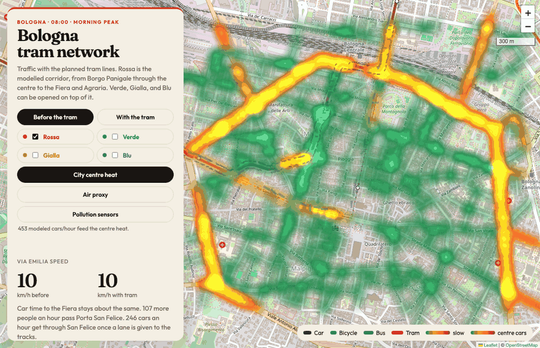
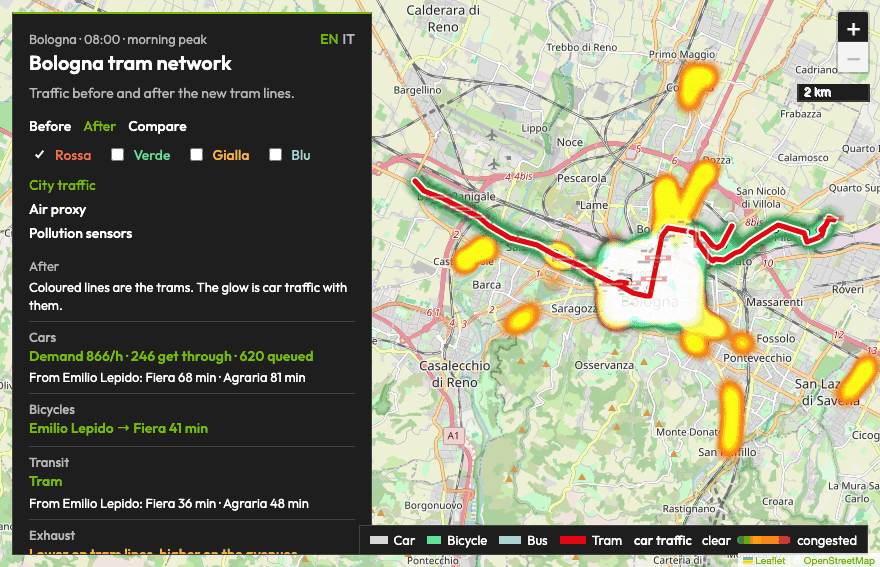
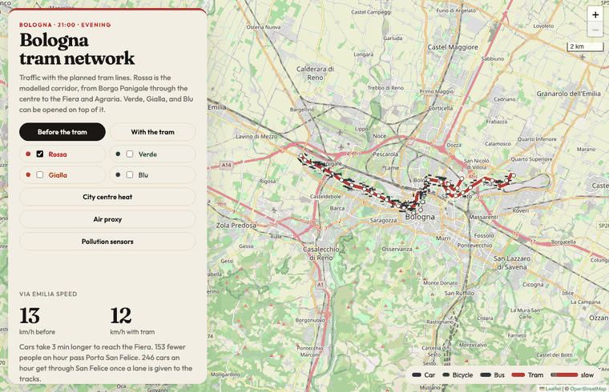
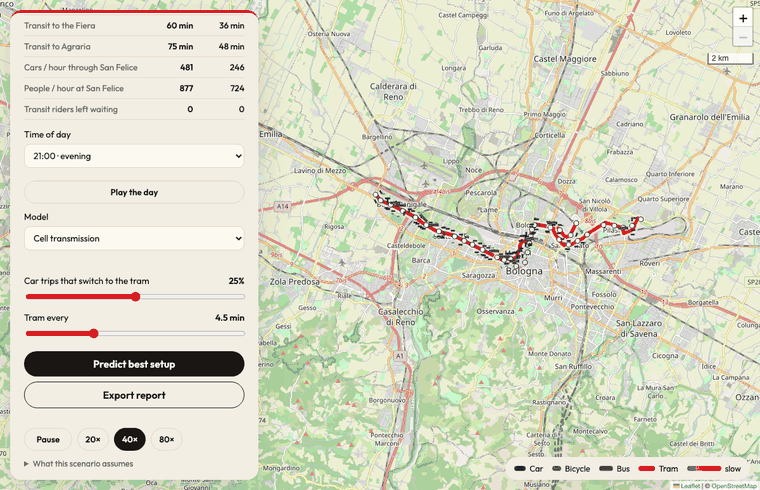
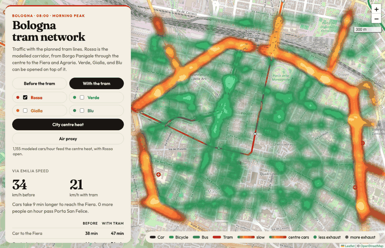
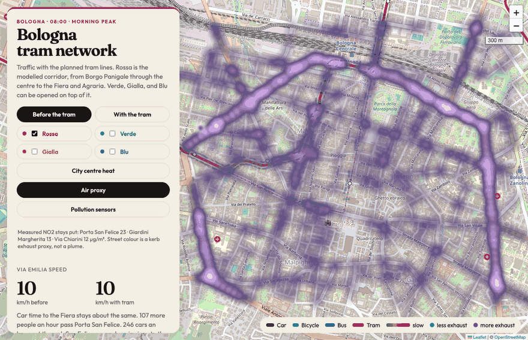
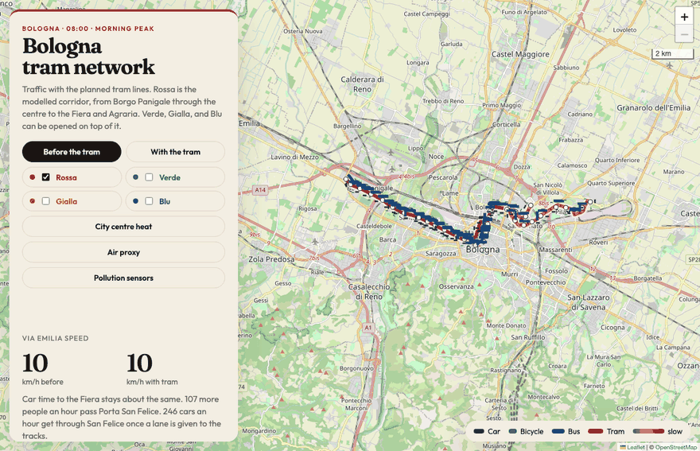

# Bologna tram traffic

A model of the tram lines planned for Bologna. **Rossa** runs from Borgo Panigale through the historic centre to the Fiera (Michelino) and to Agraria at Pilastro. **Verde**, **Gialla**, and **Blu** switch on beside it.

The map has three views. **Before** is the city with no tram: the glow is car traffic, and no tram line is drawn. **After** draws each line you tick and shows the traffic with those trams. **Compare** keeps the lines and colours the glow by the change, green where fewer cars remain and dark red where more cars gather. An open line clears its own street. Cars that stay move onto the avenues and the bypass.

Travel times are modelled only from Emilio Lepido to the Fiera and to Agraria. Verde, Gialla, and Blu change where the cars go, the exhaust proxy, and the traffic-noise estimate. They do not have their own trip times.

Pick a time of day and a model. On After and Compare, move the sliders for how many drivers switch and how often the tram runs. Every tram gets the junction, so a shorter gap leaves cars less of the 40 seconds of green and the car trips get longer. **City traffic** paints that congestion across the centre, the four corridors, and the bypass. **Air proxy** shows where the traffic model moves kerb exhaust, and leaves the measured NO2 at the three Bologna stations unchanged. **Pollution sensors** marks Porta San Felice, Giardini Margherita, and Via Chiarini. The panel also gives a traffic-noise estimate from the change in car volume. **Predict best setup** searches that model’s saved grid for the shift and tram frequency that carry the most people through San Felice, keep the waiting queue short, and limit the extra car time to the Fiera. **Export report** downloads that result as an HTML file: the chosen setup, the before-and-after table, and the other setups that were compared.



### Planned lines

Rossa starts on. Opening Verde, Gialla, and Blu draws those corridors and takes a further share of cars off the street. Closing them returns the Rossa-only result. In the morning cell-transmission case, with a quarter of drivers already on Rossa, the cars that get through San Felice move from 246 an hour to 182 when all four lines are open, then back to 246.



### Time of day

At 21:00 the same cell-transmission case asks for fewer cars than the morning peak. With a quarter of drivers switching, demand falls from 866 cars an hour to 351, and the queue at San Felice falls from 620 to 105. The glow on the streets goes quieter with that lighter demand.



### Best setup

**Predict best setup** searches the saved grid for the selected model and hour, then applies that shift and tram frequency on the map.



### Heat and car flow

With the volume-delay model, moving the switch slider changes how many cars the model gets through. The car-traffic glow follows that flow: 1,155 cars an hour at no switch, 578 when half of the drivers switch. In this model every one of those cars gets through, and the extra delay shows up in the trip time.



### Air proxy

**Air proxy** keeps the measured NO2 at Porta San Felice, Giardini Margherita, and Via Chiarini. Street colour follows the traffic model: purple before the tram, then teal where an open line takes cars off the street and purple on the avenues that take those cars.



### Pollution sensors

**Pollution sensors** places a marker on each measured station. Porta San Felice, Giardini Margherita, and Via Chiarini keep their measured NO2. The markers stay on those sites when the street-colour proxy changes.



## Disclaimer

This project is an illustration built from data that public agencies already publish on the web. The numbers on the map are the output of the models in this repository. They are not a forecast, a design study, or an official figure from the Comune di Bologna, TPER, the tram project, or any other authority.

A few inputs are assumptions, because the published data does not contain them:

- Traffic-signal **positions** come from OpenStreetMap. Signal **timings** do not. Every junction starts as a 90 second cycle with 40 seconds of green. With the tram, each passage holds the junction for 18 seconds in both directions, taken from that green, so a shorter gap leaves cars less green. The bypass keeps the fixed cycle.
- Car demand is taken from boulevard loop detectors on Viale Ercolani and Viale Pietramellara, then applied to the corridor. Those loops are not on Via Emilia.
- The bus count is the number of trips that stop at Porta San Felice between 08:00 and 09:00. The “with tram” scenario takes those buses off the alignment.
- The car-traffic glow uses OpenStreetMap streets inside the viali, samples along the four planned lines, and the bypass around the centre. The Comune counts cars on a few boulevards, not on every street. The selected model’s car flow scales the hourly boulevard demand across those streets. With the tram, the glow leaves an open line and sits on the avenues and the bypass.
- The air proxy is not a pollution plume. The three ARPAE stations in Bologna keep their measured NO2. Street colour follows the traffic model: exhaust falls where cars leave an open tram line and rises on the avenues that take those cars. **Pollution sensors** draws those three stations on the map. Wind, chemistry, and street-canyon spread are not in the model. The tram is not in service, so there is no measured before and after.
- Traffic noise is an estimate from car volume, ten times the log of the change. It is not a measurement, and it leaves out the sound of the tram itself.
- Verde, Gialla, and Blu are the other lines named on [trambologna.it](https://www.trambologna.it/). Each checkbox opens that corridor on the After and Compare views. Rossa uses the saved traffic model. Each extra open line takes a further share of cars off its street and cools the glow there. That share is a scenario, not a second city-wide assignment, and those three lines do not change the Emilio Lepido trip times.
- Car occupancy (1.3 people) and a full bus (45 people, 90 seats of capacity) are modelling choices.
- Where a cycle track already runs along most of a street in OpenStreetMap, bicycles are treated as protected. The scenario does not add new cycle tracks.

Published checks for the real line, used only as context: about 16.5 km, a tram every 4–5 minutes, about 40 minutes from Borgo Panigale to the Fiera and 52 minutes to Agraria. Passenger service is expected in 2027.

## Installation

You need [Node.js](https://nodejs.org/) 20 or newer and Python 3.12.

```bash
git clone https://github.com/gfiameni/bologna-tram-traffic.git
cd bologna-tram-traffic

npm install
python3.12 -m venv .venv
.venv/bin/pip install -r requirements.txt

npm test
npm run models
npm run dev
```

Open the URL Vite prints, usually http://localhost:5173.

`npm test` checks the browser volume-delay fallback. `npm run models` checks the Python models, including that the Warp kernels match their NumPy twins.

The page reads `public/catalog.json`, a grid of saved runs, so the map works with the dev server alone. For a slider position that is not on that grid, start the model server in a second terminal:

```bash
npm run serve-models
```

It listens on http://127.0.0.1:8765. The page calls it when you move a slider off the saved grid.

### Refresh the open data

`data/raw/` is downloaded on demand and is not part of the git repository. To pull a new extract and rebuild the saved runs:

```bash
.venv/bin/python scripts/fetch_supply.py
npm run catalog
```

`scripts/build_network.py` rebuilds `public/network.json` from named OpenStreetMap streets (`npm run network`). `scripts/build_centre.py` rebuilds `public/centre.json`, the street samples for the city-centre heatmap (`npm run centre`). `scripts/build_lines.py` rebuilds `public/lines.json` for Rossa, Verde, Gialla, and Blu (`npm run lines`).

## Run on DGX Spark

DGX Spark already has the NVIDIA driver and the CUDA 13 toolkit. The cell-transmission and car-following kernels run on the GB10 when Warp is the CUDA 13 build for Linux aarch64. The PyPI `warp-lang` wheel is built against CUDA 12.9, so install the CUDA 13 wheel below instead.

Install Node.js 20 or newer if `node --version` is older than that, then:

```bash
git clone https://github.com/gfiameni/bologna-tram-traffic.git
cd bologna-tram-traffic

npm install
python3 -m venv .venv
source .venv/bin/activate
pip install -r requirements.txt
pip install --force-reinstall \
  https://github.com/NVIDIA/warp/releases/download/v1.17.0/warp_lang-1.17.0+cu13-py3-none-manylinux_2_34_aarch64.whl

.venv/bin/python -c "import warp as wp; wp.init(); print([str(d) for d in wp.get_devices()])"
npm test
npm run models
```

The device list should include `cuda:0`. `nvidia-smi` should show the GB10.

Start the map and the model server in two terminals, with the virtualenv active in the second:

```bash
npm run dev
```

```bash
source .venv/bin/activate
npm run serve-models
```

Open http://localhost:5173 on the Spark. From another computer, forward both ports:

```bash
ssh -L 5173:localhost:5173 -L 8765:localhost:8765 <spark>
```

`npm run serve-models` evaluates slider values on CUDA. The saved grid in `public/catalog.json` was computed with the NumPy form of the same update. Rebuild it on the Spark so the file records the GPU:

```bash
npm run catalog
```

The tests check that the Warp step and the NumPy step agree.

## Technology

| Piece | Role |
| --- | --- |
| [Vite](https://vite.dev/) 6 | Dev server and production build for the map |
| [Leaflet](https://leafletjs.com/) | Map, OpenStreetMap tiles, route lines |
| Browser JavaScript | Animation, sliders, and a volume-delay fallback if `catalog.json` is missing |
| Python 3.12, [NumPy](https://numpy.org/) | Corridor models and the saved catalog |
| [NVIDIA Warp](https://nvidia.github.io/warp/) | Cell-transmission and car-following kernels. On DGX Spark, install the CUDA 13 aarch64 wheel so they run on the GB10 |
| Small NumPy network | 12-neuron surrogate trained on cell-transmission runs of this corridor |

The neural model is fit to this corridor’s cell-transmission runs. It is not a city-wide forecast model, and it does not use NVIDIA PhysicsNeMo.

## Models

The map starts on **cell transmission**. The other three answer a different question about the same corridor, the same hours, and the same before/after scenario. **Predict best setup** searches only the model that is selected, so the recommended switch and tram frequency can change when the model changes. Tram frequency changes how many people can board. It also changes how long cars wait: every tram gets the junction, so a shorter gap leaves cars less of the 40 seconds of green and lengthens the car trips. The tram’s onboard time does not include that wait. Verde, Gialla, and Blu are a further share of cars taken off the street on top of whichever model is selected.

### Volume-delay

A BPR curve plus Webster delay at each signal. Every car that is sent down the street is assumed to get through. Crowding shows up as a lower speed and a longer trip, not as a queue that stops some of the demand.

Use it for a first look at travel time: what happens to the Via Emilia speed when a lane is given to the tracks, or when more drivers switch. Also use it when the car-traffic glow should follow the switch slider. In this model the cars per hour are the demand that remains, so moving the slider from no switch to half the drivers changes the morning glow from about 1,155 to 578 cars an hour. Do not use it to ask whether the signals can clear the peak. They always can, in this curve, and the trip simply takes longer.

### Cell transmission

Daganzo’s cell model, and the default on the map. The street is split into cells of about 50 metres. Each cell sends cars forward only when the next cell has room, and a red signal stops the cell in front of it. If the green time cannot clear the arrivals, the cars that do not fit stay in the queue and fewer of them pass Porta San Felice.

Use it when the question is capacity: the morning peak, a lane taken for the tracks, or how many cars an hour the corridor can still carry. On this street the morning greens are already full, so the cars that get through San Felice stay near 246 an hour across the switch slider. Demand falls when drivers switch, and the queue is what is left over. At no switch the queue grows, because the same green lets fewer cars through while demand stays put. The glow then changes with the hour of the day more than with the slider. The neural surrogate is trained on this model, so cell transmission is also the reference when checking that surrogate.

### Car following

The Intelligent Driver Model. Cars, buses, and bicycles are individual vehicles. A bus dwells at each stop. A bicycle rides in the traffic, or at its own speed where OpenStreetMap already shows a cycle track along most of the street. Acceleration is a Warp kernel, with a NumPy twin used for the saved catalog.

Use it when the mix of vehicles matters: a bus stopped in the lane, bicycles sharing the street, or the stop-and-go that a red light starts. It is the closest of the four to the animation on the map. It is a slow run of one corridor, so it is a poor choice for a quick sweep of the city-wide glow. The saved grid is there for that sweep; the model server runs a fresh case when the sliders leave the grid.

### Neural surrogate

A 12-neuron network trained on cell-transmission runs of these streets. Seven inputs describe a piece of the corridor: cars, bicycles, buses, lanes, signals, length, and whether bicycles are protected. Two outputs are the travel time and the share of demand that gets through. The holdout error, in minutes per street, is shown in the assumptions on the map.

Use it to read a cell-transmission-like result without running the cell model, or to see how close this small network stays to the model it was trained on. The weights are fit in NumPy on this corridor only. Do not use it as a separate forecast, for another city, or for a street that was not in the training runs. It does not use NVIDIA PhysicsNeMo.

## What the scenario does

Eastbound traffic in the weekday morning peak.

- **Before:** no tram is drawn. Cars and the buses that pass Porta San Felice share the street. Bicycles use the corridor, including the centre. The glow is that car traffic.
- **After:** the lines you tick are drawn. Those buses leave the alignment, a chosen share of drivers switch, and streets where the tracks run give up a lane. Every tram gets the junction. Cars go around the historic centre on the avenues and the bypass. The tram runs on a timetable (about 7.6 m/s, 26 seconds at each stop). Bicycles stay.
- **Compare:** the After map, with before-to-after numbers, and a glow that shows where car traffic fell and where it rose.
- **Other lines:** Verde, Gialla, and Blu can be opened with Rossa. Each one takes a further share of cars off its street and cools the glow along that corridor. Rossa remains the corridor with the full traffic model.

The extract shipped with the repository, built from the sources below, uses about 1,156 cars an hour, 46 buses an hour at Porta San Felice, and 57 bicycles an hour at the Stalingrado counter.

## Data sources

Everything below is data the publishers make available online. Each source keeps its own licence. The MIT licence on the code in this repository does not replace those licences.

| Source | What this project uses | Retrieved | Licence |
| --- | --- | --- | --- |
| [OpenStreetMap](https://www.openstreetmap.org/copyright) | Named streets for the corridor, the four planned lines, highways inside the viali and the bypass for the car-traffic glow, traffic-signal positions, cycleways, bus-stop positions. Stored in `public/network.json`, `public/lines.json`, `public/centre.json`, and in the signal and stop lists inside `data/supply.json`. | Overpass, September 2026 | [ODbL 1.0](https://opendatacommons.org/licenses/odbl/1-0/) |
| [Tram Bologna](https://www.trambologna.it/) | The four planned lines: Rossa, Verde, Gialla, and Blu, and the street lists used to draw Verde, Gialla, and Blu. | September 2026 | Project pages of the tram network |
| [Comune di Bologna, Traffico viali](https://opendata.comune.bologna.it/explore/dataset/traffico-viali/) | Weekday 08:00–09:00 loop counts. The corridor demand is the median of the peak direction on Viale Ercolani (south, about 1,160 veh/h) and Viale Pietramellara (north-east, about 1,152 veh/h). | Open Data API, September 2026 | [CC BY 4.0](https://creativecommons.org/licenses/by/4.0/). Publisher: Comune di Bologna |
| [Comune di Bologna, Rilevazione flussi bici](https://opendata.comune.bologna.it/explore/dataset/colonnine-conta-bici/) | Hourly bicycle counters. The run uses Stalingrado II, the counter nearest the corridor, on 23 September 2026, 08:00–09:00 local, peak direction 57 bikes/h. | Open Data API, September 2026 | [CC BY 4.0](https://creativecommons.org/licenses/by/4.0/). Publisher: Comune di Bologna |
| [TPER GTFS, Bologna](https://solweb.tper.it/web/tools/open-data/open-data-download.aspx?source=solweb.tper.it&filename=gommagtfsbo&version=20260909&format=zip) | Weekday service on 23 September 2026, 08:00–09:00, at the Porta San Felice stop with the most trips (46 buses/h). Feed version `20260909`. | TPER open data, September 2026 | [CC BY 3.0 IT](https://creativecommons.org/licenses/by/3.0/it/) |
| [Comune di Bologna, Centraline qualità dell’aria](https://opendata.comune.bologna.it/explore/dataset/centraline-qualita-aria/) | Hourly NO2 and PM10 means, 1 January–16 September 2026, at Porta San Felice, Giardini Margherita, and Via Chiarini. Station positions are the 2019 regional UTM coordinates. Stored in `public/air.json`. | Open Data API, September 2026 | [CC BY 4.0](https://creativecommons.org/licenses/by/4.0/). Publisher: Comune di Bologna, from ARPAE Emilia-Romagna |

`public/catalog.json` and `data/surrogate.json` are computed from those inputs by the models in `sim/`.

Attribution for the street geometry: © OpenStreetMap contributors.

## Licence

Original source code in this repository is released under the [MIT Licence](LICENSE). Copyright © 2026 gfiameni.

Map geometry derived from OpenStreetMap, including `public/network.json`, `public/lines.json`, and `public/centre.json`, stays under the Open Database Licence. Counts and timetables derived from the Comune di Bologna and from TPER stay under the licences in the table above. Those files are included so the map can run offline from the raw downloads; reuse them under the upstream licence, with attribution to the publisher.
